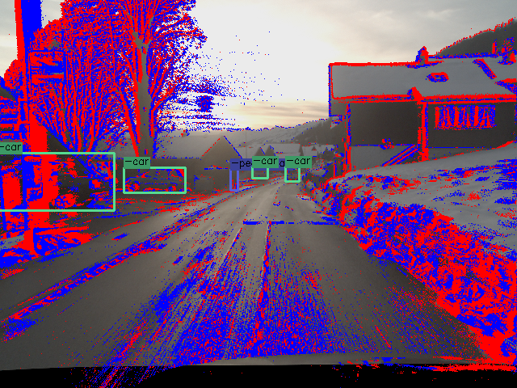

# DSEC-Detection

<p align="center">
  <a href="https://youtu.be/uX6XknBGg0w">
    
  </a>
</p>

This page contains utility functions to use the DSEC-Detection datast. It is based off of the original DSEC dataset, but has
added object detections in the left camera view. When using this dataset please cite the following two papers:

[Daniel Gehrig](https://danielgehrig18.github.io/), [Davide Scaramuzza](http://rpg.ifi.uzh.ch/people_scaramuzza.html), "Low-latency Inter-frame Object Detection with Event Cameras", arXiv, 2023

```bibtex
@InProceedings{Gehrig2023arxiv,
  author = {Daniel Gehrig and Davide Scaramuzza},
  title = {Low-latency Inter-frame Object Detection with Event Cameras},
  booktitle = {arXiv},
  month = {June},
  year = {2023}
}
```
 and the original DSEC, on which this extension is based.
[Mathias Gehrig](https://magehrig.github.io/), Willem Aarents, [Daniel Gehrig](https://danielgehrig18.github.io/) and [Davide Scaramuzza](http://rpg.ifi.uzh.ch/people_scaramuzza.html), "DSEC: A Stereo Event Camera Dataset for Driving Scenarios", RA-L, 2021
```bibtex
@InProceedings{Gehrig21ral,
  author  = {Mathias Gehrig and Willem Aarents and Daniel Gehrig and Davide Scaramuzza},
  title   = {{DSEC}: A Stereo Event Camera Dataset for Driving Scenarios},
  journal = {{IEEE} Robotics and Automation Letters},
  year    = {2021},
  doi     = {10.1109/LRA.2021.3068942}
}
```

To set up the DSEC-Detection dataset, you need to
1. download the original dataset, let us denote the path to this dataset with $DSEC_ROOT
2. download the extra datasets, let us denote the path to the extra data with $DSEC_EXTRA_ROOT
3. install the package
4. merge the datasets
4. remap the images into the event view
5. test alignment

## Download DSEC
Run the following commands to download the original DSEC dataset to the `$DATA/DSEC` folder.

```bash
bash scripts/download_dsec.sh $DATA/DSEC_original # $DATA/DSEC is the destination path
```
The individual files can be found on the official DSEC
[project webpage](https://dsec.ifi.uzh.ch/) 

## Download DSEC-extra
Run the following command to download the extra data to `$DATA/DSEC_extra`
```bash
bash scripts/download_dsec_extra.sh $DATA/DSEC_extra  # $DATA/DSEC_extra is the destination path
```

## Install the Package
To install run
```bash
git clone git@github.com:uzh-rpg/dsec-det.git
cd dsec-det/

mamba create -n dsec-det python=3.7
pip install -e .

mamba install -y -c conda-forge h5py blosc-hdf5-plugin opencv tqdm imageio pyyaml
```

## Merge the Datasets
Then to merge the datasets run the following
```bash
python scripts/merge_datasets.py --dsec $DATA/DSEC_original --dsec_det $DATA/DSEC_extra --output_path $DATA/DSEC_merged
```

## Remap Images
Since images are given in the left rectified image view, and labels are in the distorted event view, we need
to remap the images. Since this is a time consuming process, you can simply download them with the following commands: this
```bash
bash scripts/download_remapped_images.sh $DATA/DSEC_merged
```
Or regenerate them with
```bash
python scripts/remap_images_to_events.py --dsec_merged $DATA/DSEC_merged
```
This will generate a new subfolder in `$DATA/DSEC_merged/$split/$sequence/images/left` called 'distorted', where the distorted
images are stored.

## Test Alignment
You can now test alignment by running the following visualization script:
```bash
python scripts/visualize_example.py --dsec_merged $DATA/DSEC_merged --split test
```
and this will load random samples from the dataset by generating a `DSECDet` dataset class. Feel free to use it for
your deep learning applications. The output should look something like this:

<p align="center">
  <a href="https://youtu.be/uX6XknBGg0w">
    
  </a>
</p>

## Data Format
The new sequences are summarized below and follow the same naming convention as DSEC
```bash 
.
├── test
│   └── thun_02_a
└── train
    ├── zurich_city_16
    ├── zurich_city_17
    ├── zurich_city_18
    ├── zurich_city_19
    ├── zurich_city_20
    └── zurich_city_21
```

For all sequences, including the new ones, we provide object labels in the `object_detections` subfolder
```bash
sequence_name/
├── object_detections
│    └── left
│        └── tracks.npy
├─... 
```

Each `tracks.npy` file contains all the object detection, with associated track id for that sequence. It is stored as a numpy array, following the 
[format by Prophesee](https://github.com/prophesee-ai/prophesee-automotive-dataset-toolbox). The keys are explained below: 

```
t:                (uint64)  timestamp of the detection in microseconds.
x:                (float64) x-coordinate of the top-left corner of the bounding box
y:                (float64) y-coordinate of the top-left corner of the bounding box
h:                (float64) height of the bounding box
w:                (float64) width of the bounding box
class_id:         (uint8)   Class of the object in the bounding box. 
                            The classes are ('pedestrian', 'rider', 'car', 'bus', 'truck', 'bicycle', 'motorcycle', 'train')
class_confidence: (float64) Confidence of the detection. Can usually be ignored.
track_id:         (uint64)  ID of the track. Bounding boxes with the same ID belong to one track. 
```
