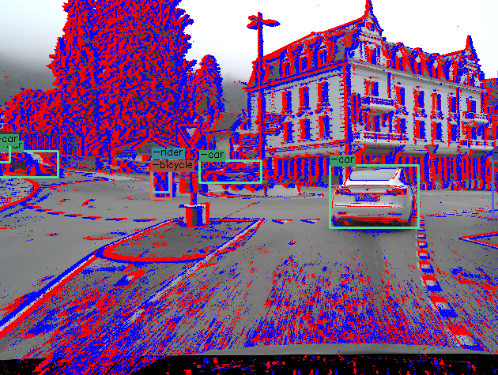

# DSEC-Detection

<p align="center">
<a href="https://youtu.be/dwzGhMQCc4Y">
  
</a>
</p>

This page contains utility functions to use the DSEC-Detection datast. It is based off of the original DSEC dataset, but has
added object detections in the left camera view. A preview of these labels, and download links can be found [here](https://dsec.ifi.uzh.ch/dsec-detection/). When using this dataset please cite the following two papers:

[Daniel Gehrig](https://danielgehrig18.github.io/), [Davide Scaramuzza](http://rpg.ifi.uzh.ch/people_scaramuzza.html),
"Low Latency Automotive Vision with Event Cameras", Nature, 2024 [Open Access PDF](https://www.nature.com/articles/s41586-024-07409-w).

```bibtex
@Article{Gehrig24nature,
  author    = {Gehrig, Daniel and Scaramuzza, Davide},
  title     = {Low Latency Automotive Vision with Event Cameras},
  booktitle = {Nature},
  year      = {2024}
}
```

 and the original DSEC, on which this extension is based.
[Mathias Gehrig](https://magehrig.github.io/), Willem Aarents, [Daniel Gehrig](https://danielgehrig18.github.io/) and [Davide Scaramuzza](http://rpg.ifi.uzh.ch/people_scaramuzza.html), "DSEC: A Stereo Event Camera Dataset for Driving Scenarios", RA-L, 2021
```bibtex
@InProceedings{Gehrig21ral,
  author  = {Mathias Gehrig and Willem Aarents and Daniel Gehrig and Davide Scaramuzza},
  title   = {{DSEC}: A Stereo Event Camera Dataset for Driving Scenarios},
  journal = {{IEEE} Robotics and Automation Letters},
  year    = {2021},
  doi     = {10.1109/LRA.2021.3068942}
}
```

To set up the DSEC-Detection dataset, you need to
1. download the original dataset, let us denote the path to this dataset with $DSEC_ROOT
2. download the DSEC-Detection including the new sequences into the existing DSEC dataset
3. remap the images into the event view, or alternatively download the remapped images
4. test alignment

## Install the Package
To install run
```bash
git clone git@github.com:uzh-rpg/dsec-det.git
cd dsec-det/

mamba create -n dsec-det python=3.7
mamba activate dsec-det
pip install -e .

mamba install -y -c conda-forge h5py blosc-hdf5-plugin opencv tqdm imageio pyyaml numba seaborn
```

## Download
### DSEC
Run the following commands to download the original DSEC dataset. The individual files can be found on the official DSEC
[project webpage](https://dsec.ifi.uzh.ch/) to download the dataset to `$DSEC_ROOT`.

```bash
DSEC_ROOT=/path/to/dsec/
bash scripts/download_dsec.sh $DSEC_ROOT # $DSEC_ROOT is the destination path
```

### DSEC-extra
Run the following command to download the extra data (events, images, etc.) and object detection labels to `$DSEC_ROOT`
```bash
bash scripts/download_dsec_extra.sh $DSEC_ROOT
```

### Remapped Images
Since images of DSEC are given in the left rectified image view, and labels are in the distorted event view, we need
to remap the images to the event view. You can simply download them with the following commands:
```bash
bash scripts/download_remapped_images.sh $DSEC_ROOT
```
This will generate a new subfolder in `$DSEC_ROOT/$split/$sequence/images/left/distorted`, where the distorted
images are stored.

## Test Alignment
You can now test alignment by running the following visualization script:
```bash
python scripts/visualize_example.py --dsec $DSEC_ROOT --split test
```
and this will load random samples from the dataset by generating a `DSECDet` dataset class. Feel free to use that class for
your deep learning applications. The syntax looks like this: 

```python
import cv2 
from pathlib import Path 

from dsec_det.dataset import DSECDet
from dsec_det.io import yaml_file_to_dict


split_config = yaml_file_to_dict(Path("./config/train_val_test_split.yaml"))

dataset = DSECDet(root=Path("path/to/dsec_root"),
                  split="test",              # can be test/train/val
                  sync="back",               # load 50 ms of event after ('back'), or before  ('front') the image
                  split_config=split_config, # which sequences go into train/val/test. See yaml file for details.
                  debug=True)                # generate debug output, available in output['debug']
        
index = 5574
output = dataset[index]

cv2.imshow("Debug", output['debug'])
cv2.waitKey(0)

```

The output should look something like this:

<p align="center">
  <a href="https://youtu.be/uX6XknBGg0w">
    
  </a>
</p>

## Data Format
The new sequences are summarized below and follow the same naming convention as DSEC
```bash 
.
├── test
│   └── thun_02_a
└── train
    ├── zurich_city_16
    ├── zurich_city_17
    ├── zurich_city_18
    ├── zurich_city_19
    ├── zurich_city_20
    └── zurich_city_21
```

For all sequences, including the new ones, we provide object labels in the `object_detections` subfolder
```bash
sequence_name/
├── object_detections
│    └── left
│        └── tracks.npy
├─... 
```
 
Each `tracks.npy` file contains all the object detection, with associated track id for that sequence. It is stored as a numpy array, following the [format by Prophesee](https://github.com/prophesee-ai/prophesee-automotive-dataset-toolbox). The keys are:

```
t:                (uint64)  timestamp of the detection in microseconds.
x:                (float64) x-coordinate of the top-left corner of the bounding box
y:                (float64) y-coordinate of the top-left corner of the bounding box
h:                (float64) height of the bounding box
w:                (float64) width of the bounding box
class_id:         (uint8)   Class of the object in the bounding box. 
                            The classes are ('pedestrian', 'rider', 'car', 'bus', 'truck', 'bicycle', 'motorcycle', 'train')
class_confidence: (float64) Confidence of the detection. Can usually be ignored.
track_id:         (uint64)  ID of the track. Bounding boxes with the same ID belong to one track. 
```


